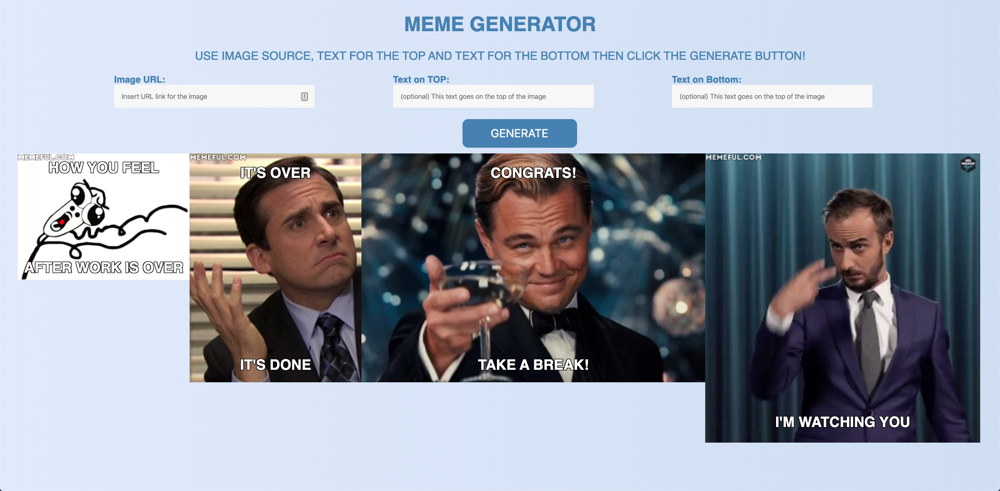

# Meme Generator

* HTML, CSS, JavaScript
* The Meme Generator consists of:
    - a form that accepts a link to an image
    - text for the top of the meme
    - text for the bottom of the meme

* When the user submits the form, use JavaScript to append to the DOM a div which contains the meme, including the image and its text.

* User should be able to submit a form on the page to generate a new meme on the page, and should be able to add multiple memes to the page by submitting the form multiple times.

* Users should be able to click on a button to remove a meme from the page.

* When the meme form is submitted, values in the form inputs should be cleared.
